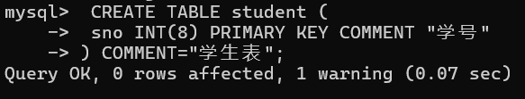

## 创建与操作MySQL数据库和表

### 1 创建 MySQL 数据库和表

#### 1.1 认识 MySQL 数据库

- **系统数据库**
pass

- **用户数据库**
pass

### 2 创建和操作 MySQL 数据库

#### 2.1 创建数据库
创建数据库的语法如下：
```sql
CREATE DATABASE [IF NOT EXISTS] 数据库名;
```
- `[]` 的内容为可选选项，代表数据库不存在时才创建数据库。
- 数据库名由英文字母、阿拉伯数字、下划线和“$”组成，可以使用任何字符开头，但不能使用单独的数字。
- 不能使用 MySQL 的关键字作为数据库名、表名。

#### 2.2 查看数据库
```sql
SHOW DATABASES [LIKE '数据库名'];
```
- `[LIKE '数据库名']`是可选参数，其中数据库名可以是完整匹配，也可以是部分匹配（使用'%'代替省略部分）。数据库名由单引号或双引号括起来。`LIKE`参数省略时，表示查询当前用户可查看的所有数据库名。

#### 2.3 选择数据库
数据是存放在表中的，表存放在数据库中，在对数据进行操作之前，需要确定该表所在的数据库。选择数据库的语法如下：
```sql
USE 数据库名;
```

#### 2.4 修改数据库
修改数据库是指修改现有数据库的相关参数，**不能修改数据库名**，语法如下：
```sql
ALTER DATABASE [数据库名] [DEFAULT] CHARACTER SET [=] 字符集;
```
该语句用于修改指定数据库的参数，为指定数据库名时则修改当前默认数据库的参数。

#### 2.5 删除数据库
应当及时删除不再使用的数据库。删除数据库的同时将删除其中所有数据对象，要**特别谨慎**，删除数据库的语法如下：
```sql
DROP DATABASE [IF EXISTS] 数据库名;
```

### 3 创建和操作表
数据库中的表是最基本的数据对象，是存储数据的基本单位。设计合理的表结构可以减少数据冗余，提升数据库性能。 

#### 3.1 创建表

创建表使用`CREATE TABLE`语句，格式如下：
```sql
CREATE TABLE [IF NOT EXISTS] 表名 (
    字段1 数据类型 [字段属性|约束] [索引] [注释],
    字段2 数据类型 [字段属性|约束] [索引] [注释],
    ...
    字段n 数据类型 [字段属性|约束] [索引] [注释]
) [表类型] [表字符集] [注释];
```

#### 3.2 注释
注释是创建表时为表或字段添加的说明性文字，使用`COMMENT`关键字添加。例如：


#### 3.3 编码格式设置
默认情况下，MySQL 中所有数据库、表、字段等使用默认字符集 UTF-8，也可以通过 my.ini 文件中的 default-character-set 参数更改默认字符集。
也可以在创建表时指定字符集，例如：
```SQL
CREATE TABLE IF NOT EXISTS student2 (
    sno INT(8) PRIMARY KEY COMMENT "学号"
) CHARSET="GB2312";
```
可以通过下面语句查看 MySQL 支持的字符集：
```sql
SHOW CHARACTER SET;
```

#### 3.3 查看表
- 查看当前数据库中所有表
    ```sql
    SHOW TABLES;
    ```
- 查看表的定义
    ```sql
    DESCRIBE 表名;
    ```
    或
    ```sql
    DESC 表名;
    ```

#### 3.4 删除表
删除表的语法如下：
```sql
DROP TABLE 表名;
```
**提示**：在删除表之前，要确认表中是否有数据，如果是空表可以直接删除；如果表中有数据，则在应用程序调试、维护期间要特别注意，要对数据库进行备份，否则造成数据丢失，无法恢复。

#### 3.5 修改表

##### 3.5.1 修改表名
pass

##### 3.5.2 添加字段
pass

##### 3.5.3 修改字段
pass

##### 3.5.4 删除字段
pass


### 4 数据完整性约束
#### 4.1 主键约束
pass

#### 4.2 唯一性约束
pass

#### 4.3 外键约束
pass

#### 4.4 CHECK 约束

#### 4.5 非空约束

