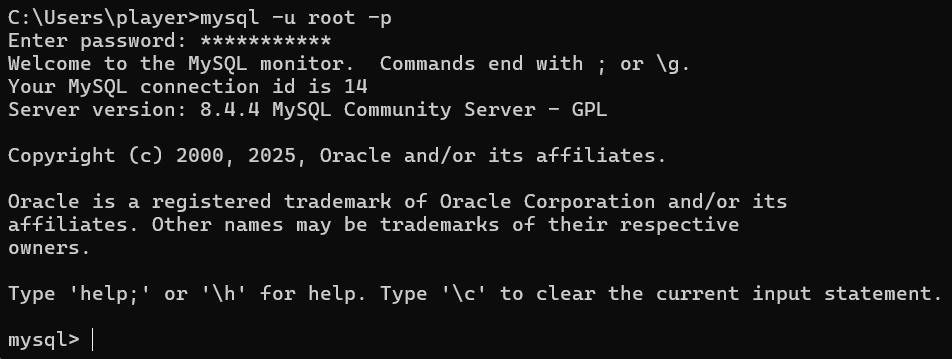

### MySQL 零基础入门（2）：数据库操作

#### 1. 连接到 MySQL

在命令提示符下连接到 MySQL，格式如下：

```sql
mysql -u root -p
```
随后输入密码，如图所示：


参数说明：
- -u 参数用于指定用户名。
- -p 参数表示需要输入密码。
- root 表示默认的管理员账户，可换为其他账户。

连接到 MySQL 后，可以在命令行中执行 SQL 查询。

- 列出所有可用的数据库：
    ```sql
    SHOW DATABASES;
    ```
- 选择要使用的数据库：
    ```sql
    USE your_database;
    ```
- 列出所选数据库中所有表：
    ```sql
    SHOW TABLES;
    ```
- 退出mysql>命令提示窗口：
    ```sql
    EXIT;
    ```
    或
    ```sql
    QUIT;
    ```