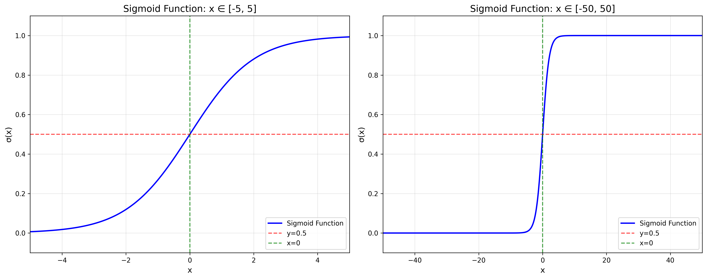

# 逻辑回归（logistic regression）

## 1 简介

逻辑回归是一种用于解决分类问题的统计学习方法，尽管其名称包含 “回归”，但实际用于处理因变量为二分类或多分类的场景（最常见的是二分类问题，如 “是 / 否”“0/1”）。它通过构建模型来预测样本属于某个类别的概率，进而实现分类。

逻辑回归的基本思想是使用线性预测器 $z=\mathbf{w}^T\mathbf{x}+b$ ，以表示 $x$ 的概率，如下：
$$\frac{P(y=1|\mathbf{x})}{P(y=0|\mathbf{x})} = e^{z}=e^{\mathbf{w}^T\mathbf{x}+b} \tag{1}$$
其中 $\mathbf{w}$ 和 $b$ 是模型参数，$\mathbf{x}$ 是样本特征。

## 2 数学推导

由于 $P(y=1|\mathbf{x})+P(y=0|\mathbf{x})=1$ ，所以有：
$$\frac{P(y=1|\mathbf{x})}{1-P(y=1|\mathbf{x})} = e^z$$
进一步简化，得到：
$$P(y=1|\mathbf{x}) = \frac{e^z}{1+e^z} = \frac{1}{1+e^{-z}} = \sigma(z) \tag{2}$$
$$P(y=0|\mathbf{x}) = 1-P(y=1|\mathbf{x}) = \frac{1}{1+e^z} \tag{3}$$
函数 $\sigma(\cdot)$ 称为 **logistic函数** 或 **sigmoid函数**，其图像如下：

只要知道了参数 $\mathbf{w}$ 和 $b$ ，就可以通过式 $(2)$ 或 $(3)$ 计算出样本属于某个类别的概率。

给定 $\mathbf{x_i}$ ，$\mathbf{w}$ 和 $b$ ，可以表示观察到 $y_i$ 的可能性： 
$$\begin{aligned}
P(y_i|\mathbf{x_i}, \mathbf{w}, b) &= P(y=1|\mathbf{x_i})^{y_i} \times P(y=0|\mathbf{x_i})^{1-y_i} \\
&= (\sigma(z_i))^{y_i} \times (1-\sigma(z_i))^{1-y_i} \\
&= (\sigma(\mathbf{w}^T\mathbf{x_i}+b))^{y_i} \times (1-\sigma(\mathbf{w}^T\mathbf{x_i}+b))^{1-y_i} \tag{4}
\end{aligned}$$

所有训练实例的可能性可以通过取单个似然积来计算：
$$L(\mathbf{w}, b) = \prod_{i=1}^nP(y_i|\mathbf{x_i}, \mathbf{w}, b) = \prod_{i=1}^n(\sigma(\mathbf{w}^T\mathbf{x_i}+b))^{y_i} \times (1-\sigma(\mathbf{w}^T\mathbf{x_i}+b))^{1-y_i} \tag{5}$$
该方程包含大量概率值，$n$ 较大时计算很容易变得不稳定，考虑似然函数的负对数（以 $e$ 为底），也称为交叉熵函数：
$$\begin{aligned}
-\log L(\mathbf{w}, b) &= -\log \prod_{i=1}^nP(y_i|\mathbf{x_i}, \mathbf{w}, b) \\
&= -\sum_{i=1}^{n} (y_i \log (P(y=1|\mathbf{x_i})) + (1-y_i) \log (P(y=0|\mathbf{x_i}))) \\
&= -\sum_{i=1}^n (y_i \log (\sigma(\mathbf{w}^T\mathbf{x_i}+b)) + (1-y_i) \log (1-\sigma(\mathbf{w}^T\mathbf{x_i}+b))) \tag{6}
\end{aligned}$$

交叉熵函数是衡量两个概率分布之间差异的常用方法，其值越小，两个分布越相似。

## 3 模型训练

## 3.1 训练目标

我们的目标是找到最优的 $\mathbf{w}$ 和 $b$ ，使得交叉熵函数最小化：$$(\mathbf{w}^*, b^*) = \arg \min_{(\mathbf{w}, b)} E(\mathbf{w}, b) = \arg \min_{(\mathbf{w}, b)} -\log L(\mathbf{w}, b) \tag{7}$$
其中 $E(\mathbf{w}, b) = -\log L(\mathbf{w}, b)$ 是损失函数。

## 3.2 梯度下降法

要强调的是，$E(\mathbf{w}, b)$ 是关于 $\mathbf{w}$ 和 $b$ 的凸函数（证明略）。

由于交叉熵损失 $E(\mathbf{w}, b)$ 是凸函数，全局存在唯一的最优解。我们使用梯度下降（Gradient Descent）或其变种（如SGD、Adam）来求解。

先计算损失函数对参数的偏导数：

设 $z_i = \mathbf{w}^T\mathbf{x}_i + b$，$\hat{y}_i = \sigma(z_i) = P(y=1|\mathbf{x}_i) = \frac{1}{1+e^{-z_i}}$

则单个样本的交叉熵损失为：
$$E_i = -y_i \log \hat{y}_i - (1-y_i) \log (1-\hat{y}_i)$$

对 $w_j$ 求偏导：
$$
\frac{\partial E_i}{\partial w_j} = \frac{\partial E_i}{\partial z_i} \cdot \frac{\partial z_i}{\partial w_j} = (\hat{y}_i - y_i) x_{ij}
$$

解释： $\frac{\partial E_i}{\partial z_i} = \hat{y}_i - y_i = \sigma(z_i) - y_i$ ，这是逻辑回归中非常重要的结论：**单个样本的损失对线性输出 $z_i$ 的导数等于预测概率减去真实标签**。 $\frac{\partial z_i}{\partial w_j} = x_{ij}$ 。
​
对 $b$ 求偏导：
$$
\frac{\partial E_i}{\partial b} = \frac{\partial E_i}{\partial z_i} \cdot \frac{\partial z_i}{\partial b} = (\hat{y}_i - y_i)
$$

整个训练集的平均损失（常用形式）为：
$$E(\mathbf{w}, b) = \frac{1}{n} \sum_{i=1}^n E_i$$

因此梯度为：
$$
\frac{\partial E}{\partial \mathbf{w}} = \frac{1}{n} \sum_{i=1}^n (\hat{y}_i - y_i) \mathbf{x}_i = \frac{1}{n} \mathbf{X}^T (\hat{y} - y) \quad , \quad 
\frac{\partial E}{\partial b} = \frac{1}{n} \sum_{i=1}^n (\hat{y}_i - y_i) \tag{8}
$$

参数更新规则（批量梯度下降）：
$$
\mathbf{w} \leftarrow \mathbf{w} - \eta \frac{\partial E}{\partial \mathbf{w}} \quad , \quad 
b \leftarrow b - \eta \frac{\partial E}{\partial b} \tag{9}
$$
其中 $\eta$ 是学习率（learning rate）。

> 注意：逻辑回归的梯度形式非常简洁，误差项 $(\hat{y}_i - y_i)$ 与线性回归的残差 $(y_i - \hat{y}_i)$ 符号刚好相反，但本质相同。

## 3.3 正则化（防止过拟合）

实际应用中常加入正则化项，常见有：

- L2正则化（权重衰减，最常用）：
  $$E_{\text{reg}}(\mathbf{w}, b) = E(\mathbf{w}, b) + \frac{\lambda}{2} \|\mathbf{w}\|^2 \tag{10}$$
  此时 $\mathbf{w}$ 的梯度变为：
  $$\frac{\partial E_{\text{reg}}}{\partial \mathbf{w}} = \frac{1}{n} \sum_{i=1}^n (\hat{y}_i - y_i) \mathbf{x}_i + \lambda \mathbf{w}$$

- L1正则化（促进稀疏性）：
  $$E_{\text{reg}}(\mathbf{w}, b) = E(\mathbf{w}, b) + \lambda \|\mathbf{w}\|_1$$

超参数 $\lambda$ 控制正则化强度， $\lambda$ 越大，模型越简单。

## 4 预测与决策

训练好模型后，对新样本 $\mathbf{x}^*$ 进行预测：

1. 计算线性得分： $z^* = \mathbf{w}^T\mathbf{x}^* + b$
2. 计算正类概率： $\hat{y} = \sigma(z^*) = \frac{1}{1+e^{-z^*}}$
3. 分类决策（默认阈值 0.5）：
   $$
   \hat{y}_{\text{class}} = 
   \begin{cases}
   1, & \text{if } \hat{y} \geq 0.5 \\
   0, & \text{otherwise}
   \end{cases}
   \quad \Leftrightarrow \quad 
   \hat{y}_{\text{class}} = \mathbb{I}(z^* \geq 0) \tag{11}
   $$

> 实际应用中可根据业务需求调整阈值（如提高召回率或精确率）。

## 5 多分类扩展

### 5.1 One-vs-Rest（OvR）

训练 $K$ 个二分类器，第 $k$ 个分类器将第 $k$ 类作为正类，其余作为负类。预测时取概率最大的类别。

### 5.2 Softmax 回归（多分类逻辑回归）

直接将 sigmoid 推广为 softmax 函数：
$$P(y=k|\mathbf{x}) = \frac{e^{\mathbf{w}_k^T\mathbf{x} + b_k}}{\sum_{j=1}^K e^{\mathbf{w}_j^T\mathbf{x} + b_j}}$$

损失函数变为多分类交叉熵：
$$E = -\frac{1}{n} \sum_{i=1}^n \sum_{k=1}^K y_{ik} \log \hat{y}_{ik}$$

## 6 优缺点总结

| 优点                                 | 缺点                     |
| ------------------------------------ | ------------------------ |
| 输出具有概率意义，可解释性强         | 对特征线性可分假设较强   |
| 参数有明确统计意义（odds ratio）     | 容易欠拟合，表达能力有限 |
| 计算效率高，在线学习友好             | 对异常值敏感             |
| 天然支持正则化，易于处理高维稀疏特征 | 多分类需扩展             |

## 7 常见面试问题

1. 为什么逻辑回归用交叉熵而不是均方误差？  
   → MSE 非凸 + 梯度饱和问题；交叉熵 + sigmoid 组合梯度形式更合理。

2. 逻辑回归可以输出特征重要性吗？  
   → 可以， $\mathbf{w}$ 的绝对值大小反映特征重要性（需标准化后比较），符号表示正负相关。

3. 如何处理类别不平衡？  
   → ① 采样（过采样/欠采样）  
   → ② 加权交叉熵（给少数类更高权重）  
   → ③ 调整决策阈值  
   → ④ 使用 AUC、F1 等评估指标

4. 如何确定模型参数如学习率、正则化强度等？
   → 网格搜索、交叉验证、早停法、学习率衰减等。
   